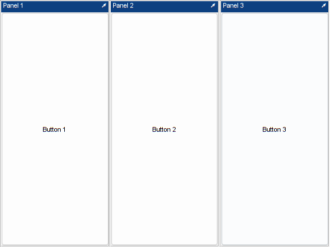
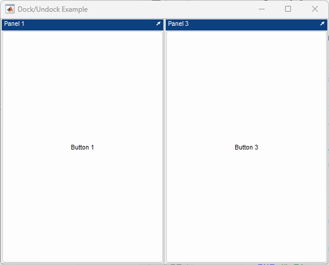

# **Dock and Undock**
<a name="beginToc"></a>

## Table of Contents
[Example](#example)
 
[Click the dock buttons](#click-the-dock-buttons)
 
&emsp;[Create the layout with three panels](#create-the-layout-with-three-panels)
 
&emsp;[Add the dock/undock callback](#add-the-dock/undock-callback)
 
&emsp;[Add the close callback](#add-the-close-callback)
 
<a name="endToc"></a>

# **Overview**

When the **`DockFcn`** property of a [**`uix.BoxPanel`**](matlab: web(fullfile(layoutDocRoot, 'uixBoxPanel.html'))) object has been populated with a callback function, a dock/undock button (with symbol **`↘ / ↗`**) is shown in the upper right of the panel's title bar. When the user clicks this button, the specified function is called.


Since redocking the panel into its previous parent depends on the type of parent object, it is up to the developer to write some code to actually extract or insert the panel.

# Example

The following example shows how to add dock/undock functionality to a box containing panels. (The code for this example can be found here: \[ view | [edit](matlab: edit(fullfile(layoutDocRoot, 'Examples', 'dockExample.m'))) | [run](matlab: p = pwd(); cd(fullfile(layoutDocRoot, 'Examples')); dockExample; cd(p)) \]).

```matlab
dockExample
```



# Click the dock buttons

Undocking the middle panel causes the other two to fill the vacated space. The undocked panel appears in its own window, with the undock symbol (**`↗`**) replaced by a dock symbol (**`↘`**).





Redocking the panel would place it in its original position within the horizontal layout. Closing the main figure window causes all panels, docked or undocked, and their enclosing figure windows to be closed.

# The `dockExample` function
## Create the layout with three panels

Create a new figure window and add three panels.


```matlab
function dockExample()

% Create a new figure window and a horizontal layout.
f = figure( 'Name', 'Dock/Undock Example', ...
    'MenuBar', 'none', ...
    'ToolBar', 'none', ...
    'NumberTitle', 'off', ...
    'CloseRequestFcn', @onCloseAll );
hbox = uix.HBox( 'Parent', f );

% Add three box panels.
boxPanels(1) = uix.BoxPanel( 'Parent', hbox, 'Title', 'Panel 1', 'UserData', 1 );
boxPanels(2) = uix.BoxPanel( 'Parent', hbox, 'Title', 'Panel 2', 'UserData', 2 );
boxPanels(3) = uix.BoxPanel( 'Parent', hbox, 'Title', 'Panel 3', 'UserData', 3 );

% Place a button in each box panel.
uicontrol( 'Parent', boxPanels(1), 'Style', 'pushbutton', ...
    'String', 'Button 1' )
uicontrol( 'Parent', boxPanels(2), 'Style', 'pushbutton', ...
    'String', 'Button 2' )
uicontrol( 'Parent', boxPanels(3), 'Style', 'pushbutton', ...
    'String', 'Button 3' )
```

## Add the dock/undock callback

We set each box panel to call the same dock/undock function. This function is nested inside the main function so that it has access to the main function's variables. A better approach for larger applications is to use classes, but a simpler approach using nested or local functions is fine for simpler applications.


Note that as soon as we set the **`DockFcn`** property, the dock/undock button appears in the upper right of each panel's title bar. We use a cell array to pass an extra argument, the panel number, to the **`onDock`** callback function. This extra argument appears after the usual **`eventSource`** and **`eventData`** input arguments.

```matlab
% Connect the dock callback to each box panel.
boxPanels(1).DockFcn = {@onDock, 1};
boxPanels(2).DockFcn = {@onDock, 2};
boxPanels(3).DockFcn = {@onDock, 3};

    function onDock( ~, ~, panelIdx )

        % Toggle the Docked status of the panel.
        boxPanels(panelIdx).Docked = ~boxPanels(panelIdx).Docked;

        if boxPanels(panelIdx).Docked
            % Put it back in the layout.
            newFigure = boxPanels(panelIdx).Parent;
            boxPanels(panelIdx).Parent = hbox;
            delete( newFigure )
            [~, sortIdx] = sort( [hbox.Contents.UserData] );
            hbox.Contents = hbox.Contents(sortIdx);
        else
            % Take it out of the layout.
            panelPosition = getpixelposition( boxPanels(panelIdx) );
            newFigure = figure( 'Name', boxPanels(panelIdx).Title, ...
                'MenuBar', 'none', ...
                'ToolBar', 'none', ...
                'NumberTitle', 'off', ...
                'CloseRequestFcn', {@onDock, panelIdx} );
            newFigure.Position(3:4) = panelPosition(3:4);
            set( boxPanels(panelIdx), 'Parent', newFigure, ...
                'Units', 'normalized', ...
                'Position', [0, 0, 1, 1] )
        end % if

    end % onDock
```

## Add the close callback

If the user closes the main figure window, we also need to close any other windows that were created. This can be done by finding the figure that contains each panel and deleting it.

```matlab
    function onCloseAll( ~, ~ )

        for k = 1 : numel( boxPanels )
            boxPanelFigure = ancestor( boxPanels(k), 'figure' );
            if ~isempty( boxPanelFigure )
                delete( boxPanelFigure )
            end % if
        end % for

    end % onCloseAll

end % dockExample
```
