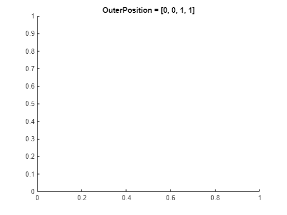
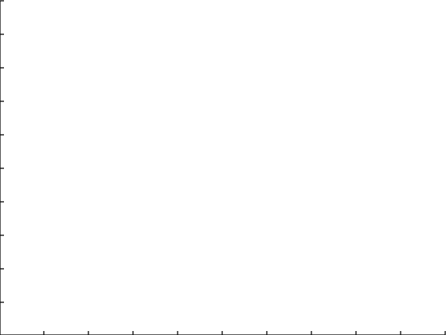

# **`Position`** **vs.** **`OuterPosition`**
<a name="beginToc"></a>

## Table of Contents
[Controlling axes layout](#controlling-axes-layout)
 
<a name="endToc"></a>

# **Introduction**

Typically we would position some axes using **`OuterPosition`** property, so that the axis labels, title, and other annotations are all contained within the specified area. Sometimes, particularly if drawing images, one might want to instead make the axes canvas (the white area) fill the specified space. This is done by setting the **`Position`** (or, equivalently, the **`InnerPosition`**) property instead.

# `OuterPosition` Example

For example, let's create an axes on a figure with **`OuterPosition`** set to **`[0, 0, 1, 1]`**.

```matlab
f = figure;
ax = axes( 'Parent', f, 'Units', 'normalized', 'OuterPosition', [0, 0, 1, 1] );
title( ax, 'OuterPosition = [0, 0, 1, 1]' )
```



# `Position` Example

Let's now create an axes on a figure with **`Position`** set to **`[0, 0, 1, 1]`**.

```matlab
f = figure;
ax = axes( 'Parent', f, 'Units', 'normalized', 'Position', [0, 0, 1, 1] );
title( ax, 'Position = [0, 0, 1, 1]' )
```



# Controlling axes layout

There are several position\-related properties and functions for getting and setting the size and location of an axes. For further information, please see the documentation reference [here](https://www.mathworks.com/help/matlab/creating_plots/automatic-axes-resize.html).

