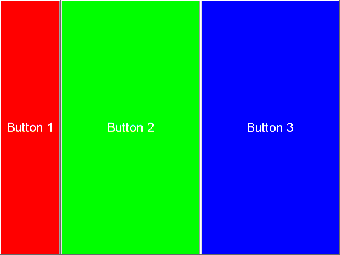

# **Sizes and Units**
<a name="beginToc"></a>

## Table of Contents
[Minimum sizes](#minimum-sizes)
 
<a name="endToc"></a>

# **`Heights`** **and** **`Widths`**

In the previous section we noted that when using layouts, you don't need to set the position or size of a user interface component yourself \- the layouts take care of it. So how do you control the sizes of the components?


Each layout that arranges multiple items within its drawing area has a sizing property: for horizontal boxes this is **`Widths`**, and for vertical boxes this is **`Heights`**. For grids we have both **`Widths`** and **`Heights`** properties. These all obey the same convention:

-  Positive numbers indicate sizes in pixels (similar to *pixel* units). 
-  Negative numbers indicate a weighting for variable sizing (similar to *normalized* units). 

By default, all sizes are set to \-1 (variable size with unit weighting).


Let's take a simple example.

```matlab
f = figure;
layout = uix.HBox( 'Parent', f );
uicontrol( 'Parent', layout, ...
    'Style', 'pushbutton', ...
    'String', 'Button 1', ...    
    'BackgroundColor', 'r', ...
    'ForegroundColor', 'w', ...
    'FontSize', 16 );
uicontrol( 'Parent', layout, ...
    'Style', 'pushbutton', ...
    'String', 'Button 2', ...    
    'BackgroundColor', 'g', ...
    'ForegroundColor', 'w', ...
    'FontSize', 16 );
uicontrol( 'Parent', layout, ...
    'Style', 'pushbutton', ...
    'String', 'Button 3', ...    
    'BackgroundColor', 'b', ...
    'ForegroundColor', 'w', ...
    'FontSize', 16 );
```


# Adjust the `Widths` using variable sizes

We can set the middle element to be twice as wide as the others (but still variable width) by settings its weight to \-2 with the other widths kept at \-1:

```matlab
layouts.Widths = [-1, -2, -1];
```

# Adjust the `Widths` using fixed and variable sizes

Alternatively, we might want the first element to have a fixed width of 100 pixels, with the others filling any remaining space equally:

```matlab
layout.Widths = [100, -1, -1];
```



This ability to mix fixed and variable sized elements is crucial in interface design. It really comes into its own when building a hierarchy of layouts, described next.

# Minimum sizes

Many of the multi\-element layouts also provide a **`MinimumWidths`** or **`MinimumHeights`** property to prevent an element from becoming too small. This is measured in pixels, and defaults to one pixel. Take care to ensure that the available space is at least the sum of the minimum sizes, plus any padding or spacing.

