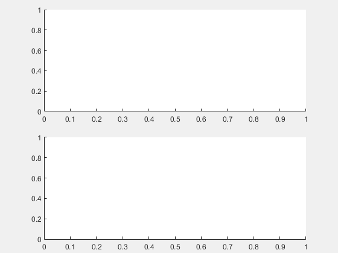
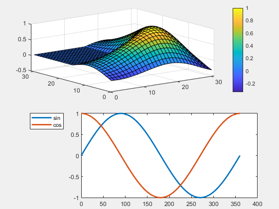

# **Colorbars and Legends**
<a name="beginToc"></a>

## Table of Contents
[Example](#example)
 
&emsp;[Create a figure](#create-a-figure)
 
&emsp;[Create the layout](#create-the-layout)
 
[Add axes decorations](#add-axes-decorations)
 
<a name="endToc"></a>

# **Overview**

When using layouts to position axes that can have a colorbar or legend, it is very important to group the axes with its colorbar and legend by placing them insider a **`uicontainer`**. The following example illustrates this.

# Example

(The code for this example can be found here: \[ [view](matlab: web(fullfile(layoutDocRoot, 'Examples', 'colorbarsAndLegends.m'))) | [edit](matlab: edit(fullfile(layoutDocRoot, 'Examples', 'colorbarsAndLegends.m'))) | [run](matlab: p = pwd(); cd(fullfile(layoutDocRoot, 'Examples')); colorbarsAndLegends; cd(p)) \]).

## Create a figure

Create a new figure window and remove the toolbar and menus.

```matlab
f = figure( 'Name', 'Axes Legends and Colorbars', ...
    'MenuBar', 'none', ...
    'ToolBar', 'none', ...
    'NumberTitle', 'off' );
```

## Create the layout

The layout involves two axes side by side. Each axes is placed into a **`uicontainer`** so that the legend and colorbar and grouped together with the axes.

```matlab
vbox = uix.VBoxFlex( 'Parent', f, 'Spacing', 3 );
axes1 = axes( 'Parent', uicontainer( 'Parent', vbox ) );
axes2 = axes( 'Parent', uicontainer( 'Parent', vbox ) );
```



# Add axes decorations

Give the first axes a colorbar and the second axes a legend.

```matlab
surf( axes1, membrane( 1, 15 ) )
colorbar( axes1 )

theta = 0:360;
plot( axes2, theta, sind( theta ), theta, cosd( theta ), 'LineWidth', 2 )
legend( axes2, 'sin', 'cos', 'Location', 'northwestoutside' )
```


