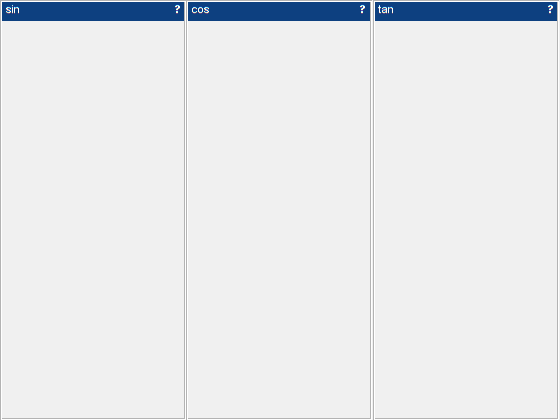

# **Context Help**
<a name="beginToc"></a>

## Table of Contents
[Example](#example)
 
<a name="endToc"></a>

# **Overview**

When the **`HelpFcn`** property of a [**`uix.BoxPanel`**](matlab: web(fullfile(layoutDocRoot, 'uixBoxPanel.html'))) object has been populated with a callback function, a help button (with symbol **`?`**) is shown in the upper right of the panel's title bar. When the user clicks this button, the specified function is called.

# Example

In the following example, we define the **`HelpFcn`** to open the MATLAB documentation for each function. Clicking any of the **`?`** buttons will open the documentation at the corresponding function page. 


Recall that a callback function always accepts two compulsory input arguments: the *source* of the event that triggered the callback (**`s`**), and the data associated with the event (**`e`**). If we use an anonymous function to specify the callback function, it will have the following general form.

```
callbackFcn = @(s, e) f(s, e);
```

where **`f`** is a function of the event source **`s`** and event data **`e`**.

```matlab
f = figure( 'Name', 'uix.BoxPanel Help Example' );
b = uix.HBox( 'Parent', f );
uix.BoxPanel( 'Parent', b, 'Title', 'sin', 'HelpFcn', @(s, e) doc( 'sin' ) );
uix.BoxPanel( 'Parent', b, 'Title', 'cos', 'HelpFcn', @(s, e) doc( 'cos' ) );
uix.BoxPanel( 'Parent', b, 'Title', 'tan', 'HelpFcn', @(s, e) doc( 'tan' ) );
```


