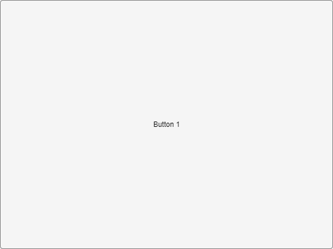
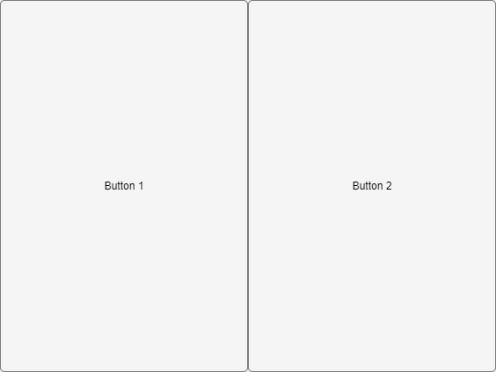
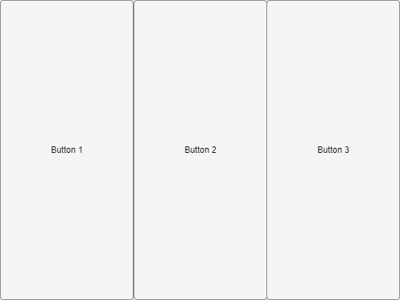
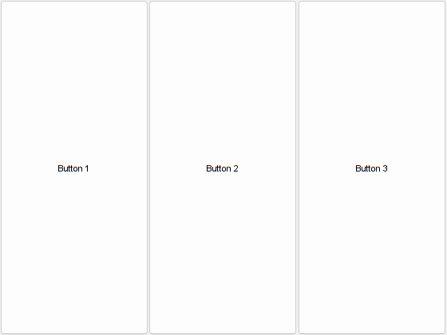
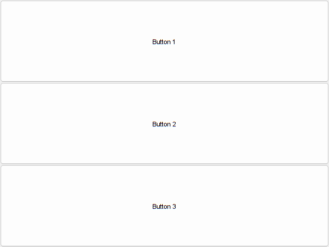
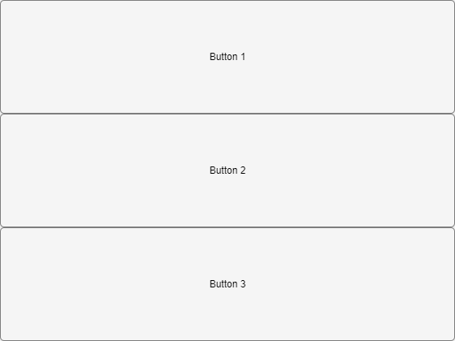
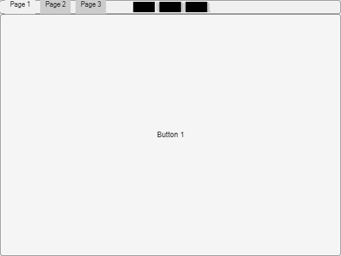

# **Layout Basics**
<a name="beginToc"></a>

## Table of Contents
[Create a basic layout](#create-a-basic-layout)
 
[Add a second control to the layout](#add-a-second-control-to-the-layout)
 
[Add a third control to the layout](#add-a-third-control-to-the-layout)
 
[Further layouts](#further-layouts)
 
[Layouts in web graphics](#layouts-in-web-graphics)
 
<a name="endToc"></a>

# Create a basic layout

To see how layouts work, let's use the most basic layout, a horizontal box. We first create a figure window.

```matlab
f = figure;
```

Now let's create the horizontal layout and add it to the figure. Note that in common with other MATLAB graphics objects, one object is added to another by setting the **`Parent`** property \- this will automatically adjust the list of **`Children`** in the parent object. The job of a horizontal box layout is to arrange its contents in a horizontal line, setting the position of each element to best fill the space.

```matlab
layout = uix.HBox( 'Parent', f );
```

Nothing's changed! That's because the layout is for arranging other user interface components \- it doesn't draw anything itself. Let's add some buttons. Note how after creating each button, the existing contents of the box make room for the new addition; we don't need to set the position of any user interface component!

```matlab
uicontrol( 'Parent', layout, 'Style', 'pushbutton', 'String', 'Button 1' )
```



# Add a second control to the layout

Add the second button.

```matlab
uicontrol( 'Parent', layout, 'Style', 'pushbutton', 'String', 'Button 2' )
```



# Add a third control to the layout

Add the third button.

```matlab
uicontrol( 'Parent', layout, 'Style', 'pushbutton', 'String', 'Button 3' )
```





# Further layouts

Other layouts work in exactly the same way, although visually the end result is quite different:

```matlab
f = figure;
layout = uix.VBox( 'Parent', f );
uicontrol( 'Parent', layout, 'Style', 'pushbutton', 'String', 'Button 1' )
uicontrol( 'Parent', layout, 'Style', 'pushbutton', 'String', 'Button 2' )
uicontrol( 'Parent', layout, 'Style', 'pushbutton', 'String', 'Button 3' )
```



```matlab
f = figure;
layout = uix.TabPanel( 'Parent', f );
uicontrol( 'Parent', layout, 'Style', 'pushbutton', 'String', 'Button 1' )
uicontrol( 'Parent', layout, 'Style', 'pushbutton', 'String', 'Button 2' )
uicontrol( 'Parent', layout, 'Style', 'pushbutton', 'String', 'Button 3' )
```


# Layouts in web graphics

In web graphics, the example code for **`uix.VBox`** is as follows:

```matlab
f = uifigure( "AutoResizeChildren", "off" );
layout = uix.VBox( "Parent", f );
uibutton( "Parent", layout, "Text", "Button 1" );
uibutton( "Parent", layout, "Text", "Button 2" );
uibutton( "Parent", layout, "Text", "Button 3" );
```



Similarly, for **`uix.TabPanel`** we have:

```matlab
f = uifigure( "AutoResizeChildren", "off" );
layout = uix.TabPanel( "Parent", f );
uibutton( "Parent", layout, "Text", "Button 1" );
uibutton( "Parent", layout, "Text", "Button 2" );
uibutton( "Parent", layout, "Text", "Button 3" );
```


