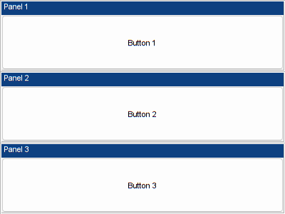

# **Minimize and Maximize**
<a name="beginToc"></a>

## Table of Contents
[Example](#example)
 
&emsp;[Create the layout with three panels](#create-the-layout-with-three-panels)
 
&emsp;[Add the minimize/maximize callback](#add-the-minimize/maximize-callback)
 
<a name="endToc"></a>

# **Overview**

When the **`MinimizeFcn`** property of a [**`uix.BoxPanel`**](matlab: web(fullfile(layoutDocRoot, 'uixBoxPanel.html'))) object has been populated with a callback function, a minimize/maximize button (with symbol **`▴/▾`**) is shown in the upper right of the panel's title bar. When the user clicks this button, the specified function is called.


Since the behavior of the parent container is different in different use cases, it is up to the user to write some code to actually resize the panel. Note that minimizing a panel to its title bar only really makes sense inside a [**`uix.VBox`**](matlab: web(fullfile(layoutDocRoot, 'uixVBox.html'))) or [**`uix.VBoxFlex`**](matlab: web(fullfile(layoutDocRoot, 'uixVBoxFlex.html'))) layout.

# Example

The following example shows how to add minimize/maximize functionality to a box containing panels. (The code for this example can be found here: \[ view | [edit](matlab: edit(fullfile(layoutDocRoot, 'Examples', 'minimizeExample.m'))) | [run](matlab: p = pwd(); cd(fullfile(layoutDocRoot, 'Examples')); minimizeExample; cd(p)) \]).

```matlab
minimizeExample
```



# The `minimizeExample` function
## Create the layout with three panels

Create a new figure window and add three panels.


```matlab
function minimizeExample()

figureWidth = 400;
minPanelHeight = 20;
maxPanelHeight = 100;

% Create the figure window and a vertical layout.
f = figure( 'Name', 'Minimize/Maximize Example', ...
    'MenuBar', 'none', ...
    'ToolBar', 'none', ...
    'NumberTitle', 'off' );
vbox = uix.VBox( 'Parent', f );

% Add three box panels.
boxPanels(1) = uix.BoxPanel( 'Parent', vbox, 'Title', 'Panel 1' );
boxPanels(2) = uix.BoxPanel( 'Parent', vbox, 'Title', 'Panel 2' );
boxPanels(3) = uix.BoxPanel( 'Parent', vbox, 'Title', 'Panel 3' );
vbox.Heights = maxPanelHeight * [1, 1, 1];

% Place a button in each box panel.
uicontrol( 'Parent', boxPanels(1), 'Style', 'pushbutton', 'String', 'Button 1' )
uicontrol( 'Parent', boxPanels(2), 'Style', 'pushbutton', 'String', 'Button 2' )
uicontrol( 'Parent', boxPanels(3), 'Style', 'pushbutton', 'String', 'Button 3' )

% Resize the figure window.
f.Position(3:4) = [figureWidth, sum( vbox.Heights )];
```

## Add the minimize/maximize callback

We set each box panel to call the same minimize/maximize function. This function is nested inside the main function so that it has access to the main function's variables. A better approach for larger applications is to use classes, but a simpler approach using nested or local functions is fine for simpler applications.


Note that as soon as we set the **`MinimizeFcn`** property, the minimize/maximize button appears in the upper right of each panel's title bar. We use a cell array to pass an extra argument, the panel number, to the **`onMinimize`** callback function. This extra argument appears after the usual **`eventSource`** and **`eventData`** input arguments.

```matlab
% Connect the minimize callback to each box panel.
boxPanels(1).MinimizeFcn = {@onMinimize, 1};
boxPanels(2).MinimizeFcn = {@onMinimize, 2};
boxPanels(3).MinimizeFcn = {@onMinimize, 3};

    function onMinimize( ~, ~, panelIdx )

        % Retrieve the row heights from the vertical box layout.
        rowHeights = vbox.Heights;

        % Retrieve the figure position.
        figurePosition = f.Position;

        % Toggle the Minimize status of the panel.
        boxPanels(panelIdx).Minimized = ~boxPanels(panelIdx).Minimized;

        % Expand or collapse the corresponding panel.
        if boxPanels(panelIdx).Minimized
            rowHeights(panelIdx) = minPanelHeight;
        else
            rowHeights(panelIdx) = maxPanelHeight;
        end % if
        vbox.Heights = rowHeights;

        % Resize the figure, keeping the top stationary.
        deltaHeight = figurePosition(4) - sum( vbox.Heights );
        f.Position = figurePosition + [0, deltaHeight, 0, -deltaHeight];

    end % onMinimize

end % minimizeExample
```
