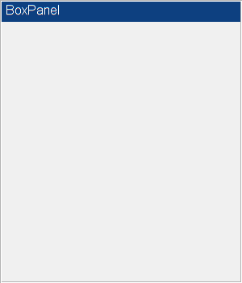
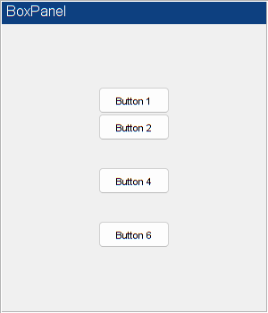

# **Visible Example**
<a name="beginToc"></a>

## Table of Contents
[Example](#example)
 
[Put some buttons inside the panel.](#put-some-buttons-inside-the-panel.)
 
[Toggle the visibility of the box panel.](#toggle-the-visibility-of-the-box-panel.)
 
[Restore the box panel visibility.](#restore-the-box-panel-visibility.)
 
<a name="endToc"></a>

# **Overview**

This example shows how the **`Visible`** property can be used to hide whole sections of an interface.

# Example

(The code for this example can be found here: \[ [view](matlab: web(fullfile(layoutDocRoot, 'Examples', 'visibleExample.m'))) | [edit](matlab: edit(fullfile(layoutDocRoot, 'Examples', 'visibleExample.m'))) | [run](matlab: p = pwd(); cd(fullfile(layoutDocRoot, 'Examples')); visibleExample; cd(p)) \]).


Create a new figure window and add a box panel.

```matlab
f = figure( 'Name', 'Visible Example', ...
    'MenuBar', 'none', ...
    'ToolBar', 'none', ...
    'NumberTitle', 'off' );
f.Position(3:4) = [300, 350];
panel = uix.BoxPanel( 'Parent', f, ...
    'Title', 'BoxPanel', ...
    'FontSize', 12 );
```



# Put some buttons inside the panel.

First, create a vertical button box to hold the buttons.

```matlab
box = uix.VButtonBox( 'Parent', panel, 'ButtonSize', [80, 30] );
```

Place a selection of buttons with mixed visibilities inside the button box.

```matlab
uicontrol( 'Parent', box, 'Style', 'pushbutton', 'String', 'Button 1' )
uicontrol( 'Parent', box, 'Style', 'pushbutton', 'String', 'Button 2' )
uicontrol( 'Parent', box, 'Style', 'pushbutton', 'String', 'Button 3', ...
    'Visible', 'off' )
uicontrol( 'Parent', box, 'Style', 'pushbutton', 'String', 'Button 4' )
uicontrol( 'Parent', box, 'Style', 'pushbutton', 'String', 'Button 5', ...
    'Visible', 'off' )
uicontrol( 'Parent', box, 'Style', 'pushbutton', 'String', 'Button 6' )
```



# Toggle the visibility of the box panel.
```matlab
panel.Visible = 'off';
```


# Restore the box panel visibility.

Note that the original **`Visible`** state of each button has been preserved.

```matlab
panel.Visible = 'on';
```


