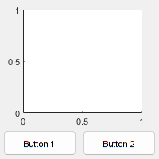
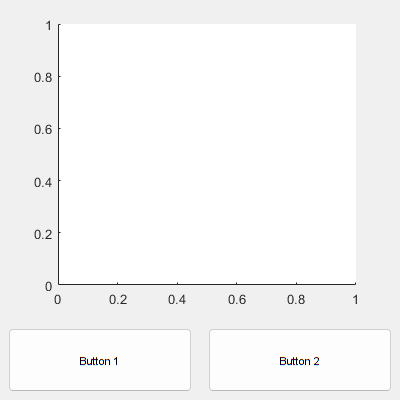
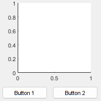
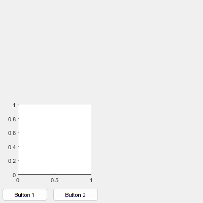
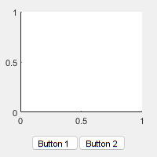
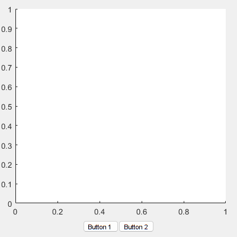

# **Why Use Layouts?**
<a name="beginToc"></a>

## Table of Contents
[Introduction](#introduction)
 
[Normalized units](#normalized-units)
 
[Resize the figure window](#resize-the-figure-window)
 
[Pixel units](#pixel-units)
 
[Resize the figure window](#resize-the-figure-window)
 
[Using layouts](#using-layouts)
 
&emsp;[Example](#example)
 
[Resize the figure window](#resize-the-figure-window)
 
<a name="endToc"></a>

# Introduction

The overriding reason for using layouts or layout managers is to gain control of the resizing behavior of the interface without having to write a complex **`SizeChangedFcn`** callback on the app's main figure window or containers such as panels, tabs, etc. If you position user\-interface elements directly, i.e., by setting their **`Position`** property, then you have two choices about what happens when the figure window resizes.

# Normalized units

Using normalized units, the user\-interface components scale with the figure window. In the example below, we don't really want the buttons to grow, but everything will resize in proportion when the figure window is resized.

```matlab
f = figure( 'Position', 200 * ones( 1, 4 ) );
axes( 'Parent', f, ...
    'Units', 'normalized', ...
    'OuterPosition', [0.02, 0.2, 0.96, 0.8] )
uicontrol( 'Parent', f, ...
    'Units', 'normalized', ...
    'Position', [0.02, 0.02, 0.46, 0.16], ...
    'String', 'Button 1' )
uicontrol( 'Parent', f, ...
    'Units', 'normalized', ...
    'Position', [0.52, 0.02, 0.46, 0.16], ...
    'String', 'Button 2' )
```



# Resize the figure window

After the figure window is resized, note that the buttons have grown proportionally.

```matlab
f.Position(3:4) = 400;
```



# Pixel units

Using pixel units, the user\-interface components stay fixed and resizing the figure window creates empty space. In the example below, although the buttons will no longer grow in size as the figure window is enlarged, neither does the axes, which looks very odd.

```matlab
f = figure( 'Position', 200 * ones( 1, 4 ) );
axes( 'Parent', f, ...
    'Units', 'pixels', ...
    'OuterPosition', [10, 35, 190, 175] )
uicontrol( 'Parent', f, ...
    'Units', 'pixels', ...
    'Position', [5, 5, 90, 25], ...
    'String', 'Button 1' )
uicontrol( 'Parent', f, ...
    'Units', 'pixels', ...
    'Position', [105, 5, 90, 25], ...
    'String', 'Button 2' )
```



# Resize the figure window

After the figure window is resized, note that there is empty space on the figure.

```matlab
f.Position(3:4) = 400;
```



# Using layouts

Neither of these alternatives (purely normalized units or purely pixel units) is particularly useful for a serious user interface. Typically there are user\-interface components that should be fixed size: icons, buttons, selectors, etc; and others that should resize with the figure window: graphs, images, prose text, etc. To achieve this one needs to be able to specify which interface components should be fixed size, and which should be variable size. Over the last three decades, layouts have proved to be the method of choice for achieving this.

## Example

Using layouts, some user\-interface components scale with the figure window, whereas others stay fixed.

```matlab
f = figure( 'Position', 200 * ones( 1, 4 ) );
vbox = uix.VBox( 'Parent', f );
axes( 'Parent', vbox )
hbox = uix.HButtonBox( 'Parent', vbox, 'Padding', 5 );
uicontrol( 'Parent', hbox, ...
    'Style', 'pushbutton', ...
    'String', 'Button 1 ' )
uicontrol( 'Parent', hbox, ...
    'Style', 'pushbutton', ...
    'String', 'Button 2' )
vbox.Heights = [-1, 35];
```



# Resize the figure window

Note that the buttons in the button box have remained with a fixed height, whereas the axes has grown to fill the available space.

```matlab
f.Position(3:4) = 400;
```


