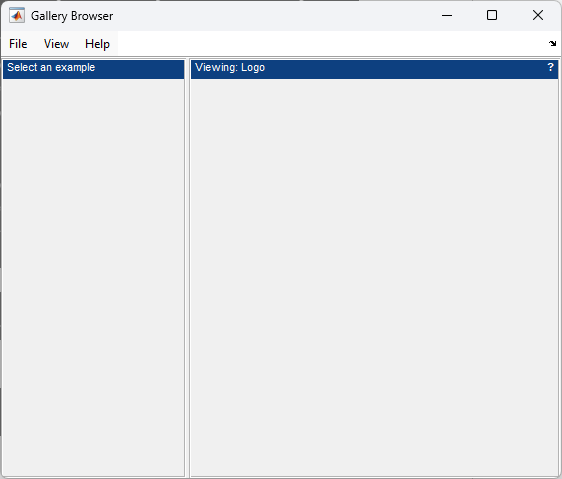
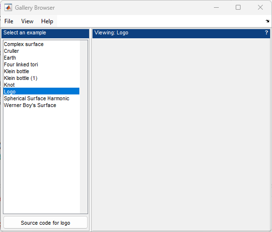
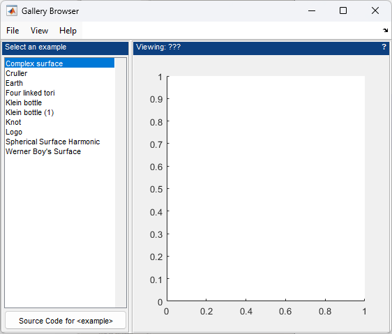

# Creating the User Interface

The interface creation is handled in the `createInterface` function. This has two distinct sections: menu building and control arrangement. The menus are created using the [`uimenu`](https://www.mathworks.com/help/matlab/ref/uimenu.html) function, so in what follows we'll focus on the control arrangement.

The top-level layout is a horizontal box, placing the controls to the left of the main plot. We make the layout flexible by using the "flex" variant of `HBox`, and put a panel in each side of the layout. Note that setting the `HelpFcn` for the view panel adds a small `?` icon that we can use to open help or documentation for the current example. See the [`ContextHelp`](ContextHelp.md) example for more details.

```matlab
% Arrange the main interface
mainLayout = uix.HBoxFlex( 'Parent', app.Figure, 'Spacing', 3 );

% Create the panels
controlPanel = uix.BoxPanel( 'Parent', mainLayout, ...
    'Title', 'Select an example' );
app.ViewPanel = uix.BoxPanel( 'Parent', mainLayout, ...
    'Title', 'Viewing: ???', ...
    'HelpFcn', @onSourceCodeRequested );
app.ViewContainer = uicontainer( 'Parent', app.ViewPanel );

% Adjust the main layout
mainLayout.Widths = [-1, -2]; 
```



Next, we create a vertical layout in the control panel containing the listbox and a button. Note the callbacks that are specified for both the list and button. These both call further nested functions that are able to access the common `data` and `app` shared structures.

```matlab
 % Create the controls
controlLayout = uix.VBox( 'Parent', controlPanel, ...
    'Padding', 3, 'Spacing', 3 );
app.ListBox = uicontrol( 'Parent', controlLayout, ...
    'Style', 'listbox', ...    
    'String', exampleList(:), ...
    'Value', 1, ...
    'Callback', @onListSelection );
app.SourceCodeButton = uicontrol( 'Style', 'pushbutton', ...
    'Parent', controlLayout, ...
    'String', 'Source Code for <example>', ...
    'Callback', @onSourceCodeRequested );

% Make the list fill the space
controlLayout.Heights = [-1, 28]; 
```



Finally, the view itself is simply an axes placed inside the view panel.

```matlab
% Create the view        
app.ViewAxes = axes( 'Parent', app.ViewContainer ); 
```



The complete source code for this application is available in `galleryBrowser.m`.

## Related Topics

* [Application Structure](ApplicationStructure.md)
* [Updating the User Interface](UpdateInterface.md)
* [Responding to User Interaction](OnListSelection.md)
* [Launching the Application](RunningIt.md)
* [Scalability and Architecture](Scalability.md)

___

[home](index.md) :house: | :copyright: [MathWorks](https://www.mathworks.com/services/consulting.html) 2009-2025