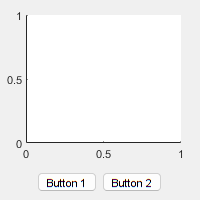
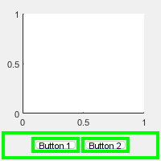

# Layout Hierarchies

## A simple layout hierarchy

Consider the following simple interface:



Instead of thinking of this in terms of three elements that need positioning, we can break it up into two simple linear ("box") arrangements: a vertical box with the axes at the top and a control area at the bottom, and a horizontal box containing two buttons:





By placing the second layout (horizontal box) inside the first (vertical box), we arrive at the complete layout. Since the sizes of the elements in each list can be set to be fixed or flexible, we can achieve a user interface that is not just arranged correctly when created, but also behaves well when resized.


Note that the buttons have remained with a fixed height after the window size has been increased, and the axes have resized to fill the remaining space.

## Create the figure and the axes in a vertical layout

The example above can be created programmatically by closely following the text description. The example code is available in `layoutHierarchy.m`.

```matlab
edit layoutHierarchy 
```

Create a figure window.

```matlab
f = figure( 'Position', 200 * ones( 1, 4 ) );
```

Create the first layout (the vertical box). Inside this vertical box we place the axes.

```matlab
vb = uix.VBox( 'Parent', f );
axes( 'Parent', vb )
```

## Add the buttons to a horizontal layout inside the vertical layout

Create the second layout (the horizontal box). Inside this horizontal box we place the two buttons.

```matlab
hb = uix.HButtonBox( 'Parent', vb, 'Padding', 5, 'Spacing', 5 );
uicontrol( 'Parent', hb, 'Style', 'pushbutton', 'String', 'Button 1' )
uicontrol( 'Parent', hb, 'Style', 'pushbutton', 'String', 'Button 2' )
```

Set the sizes. We want the axes to resize dynamically as the figure window is resized, so we set the first height to be \-1 (which means variable size with weight 1). We want the buttons to remain with a fixed height, so we set the second height to 35 (which means a fixed height of 35 pixels).

```matlab
vb.Heights = [-1, 35];
```

## Related Topics

* [Vertical layouts](uixVBox.md)
* [Horizontal button boxes](uixHButtonBox.md)
* [`figure`](https://www.mathworks.com/help/matlab/ref/figure.html)
* [`axes`](https://www.mathworks.com/help/matlab/ref/axes.html)
* [`uicontrol`](https://www.mathworks.com/help/matlab/ref/uicontrol.html)
