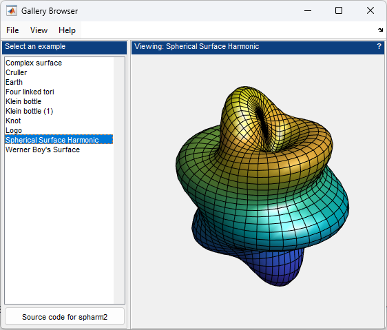

# `updateInterface`

The second function we will look at, `updateInterface`, uses the current selection together with the relevant content in the `data` structure to update the interface. The following steps are used in the update process.

* Update the selected item in the listbox.

```matlab
app.ListBox.Value = data.SelectedExample; 
```

* Update the source code button label.

```matlab
exampleFunction = data.ExampleFunctions{data.SelectedExample};
app.SourceCodeButton.String = ['Source code for ', exampleFunction]; 
```

* Update the view panel title.

```matlab
exampleName = data.ExampleNames{data.SelectedExample};
app.ViewPanel.Title = sprintf( 'Viewing: %s', exampleName ); 
```

* Update the selected menu.

```matlab
menus = get( app.ViewMenu, 'Children' );
set( menus, 'Checked', 'off' )
whichMenu = strcmpi( exampleName, get( menus, 'Label' ) );
menus(whichMenu).Checked = 'on'; 
```



In general, this update function is called whenever the underlying shared `data` structure is changed. This happens when the user clicks a button, or selects a list item or menu. Next, we will look at a typical callback.

The complete source code for this application is available in `galleryBrowser.m`.

```matlab
edit galleryBrowser 
```