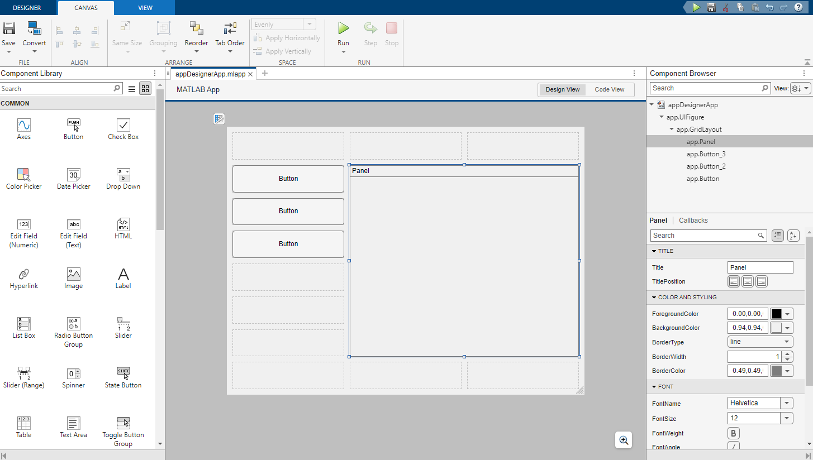
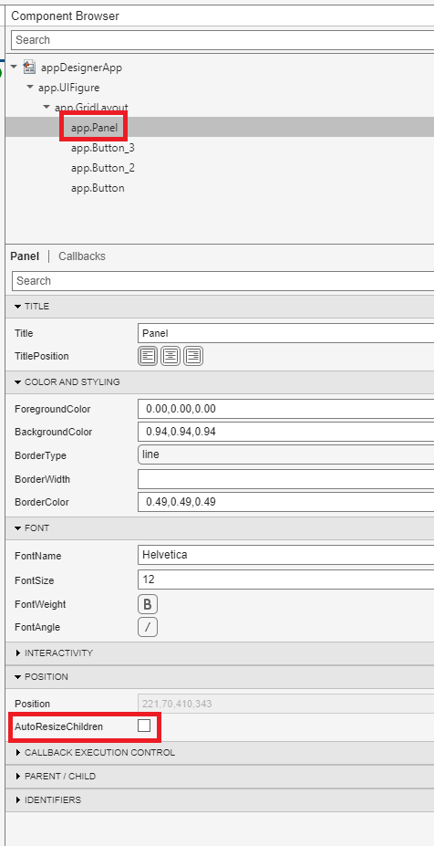
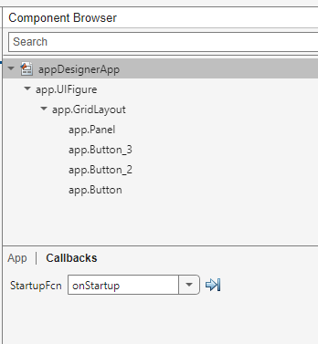

# Using Layouts in App Designer

## Overview

Whilst the layouts in this toolbox do not integrate directly into [App Designer](https://www.mathworks.com/products/matlab/app-designer.html), it is possible to insert layouts into an app created with App Designer using the process described below.

# Create the App Designer app

Create your App Designer application as usual, placing a panel where you want to insert the layout. You can turn the panel border and title off if you do not want them.



Ensure that you set the `AutoResizeChildren` property of the panel to `false`.



# Insert the layout

Next, add the `StartupFcn` callback to the app. We'll name this callback `onStartup`.



Edit the `onStartup` callback in the App Designer-generated code and insert your layout into the panel, making it fill the space. In the example below, four box panels are inserted into a grid, which itself is placed inside the panel referenced by `app.Panel`.

```matlab
% Code that executes after component creation
function onStartup(app)
    % Put a layout in the panel
    g = uix.GridFlex( 'Parent', app.Panel, ...
    'Units', 'normalized', ...
    'Position', [0, 0, 1, 1], ...
    'Spacing', 5, ...
    'Padding', 5 );
    uix.BoxPanel( 'Parent', g, 'Title', 'Panel 1' );
    uix.BoxPanel( 'Parent', g, 'Title', 'Panel 2' );
    uix.BoxPanel( 'Parent', g, 'Title', 'Panel 3' );
    uix.BoxPanel( 'Parent', g, 'Title', 'Panel 4' );
    g.Heights = [-1, -1]; 
end 
```

Launch the app.

```matlab
appDesignerApp
```

# Source code

The source code for this application is available in `appDesignerApp.mlapp`.

```matlab
edit appDesignerApp 
```