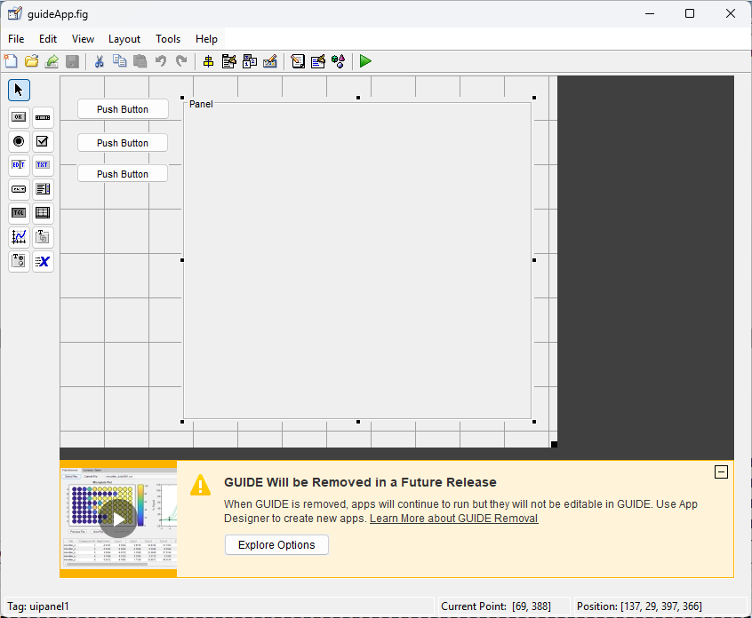

# **Using Layouts in GUIDE**

# **Overview**

Whilst the layouts in this toolbox do not integrate into the MATLAB Graphical User Interface Design Environment ([**`GUIDE`**](https://www.mathworks.com/help/matlab/ref/guide.html)), it is possible to insert layouts into an app created with GUIDE using the process described below.

# Important Note

In the R2019b release, MathWorks announced that **`GUIDE`** will be removed in a future release. For further information on this upcoming change, and migration strategies, see [**GUIDE Migration Strategies**](https://www.mathworks.com/help/matlab/creating_guis/differences-between-app-designer-and-guide.html).

# Create the **`GUIDE`** app

Create your **`GUIDE`** application as usual, placing a panel where you want to insert the layout. You can turn the panel border and title off if you do not want them.



# Insert the layout

Edit the **`OpeningFcn`** in the **`GUIDE`**\-generated code and insert your layout into the panel, making it fill the space. In the example below, four box panels are inserted into a grid, which itself is placed inside the panel with tag **`uipanel1`**.

```matlab
% --- Executes just before guideApp is made visible. 
function guideApp_OpeningFcn(hObject, eventdata, handles, varargin)

% Choose default command line output for guideApp 
handles.output = hObject;

% Update handles structure 
guidata(hObject, handles);

% Put a layout in the panel 
g = uix.GridFlex( 'Parent', handles.uipanel1, ...
    'Units', 'normalized', 'Position', [0, 0, 1, 1], ...
    'Spacing', 5 );
uix.BoxPanel( 'Parent', g, 'Title', 'Panel 1' );
uix.BoxPanel( 'Parent', g, 'Title', 'Panel 2' );
uix.BoxPanel( 'Parent', g, 'Title', 'Panel 3' );
uix.BoxPanel( 'Parent', g, 'Title', 'Panel 4' );
g.Heights = [-1, -1]; 
```

Launch the app.

```matlab
guideApp
```

# Source code

The source code for this application is available in `guideApp.m`.

```matlab
edit guideApp 
```