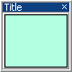

# `uix.BoxPanel`



Arrange a single element in a panel with boxed title and optional toolbar controls

## Syntax
* `bp = uix.BoxPanel()` creates a box-styled panel object with automatic management of the contained control or layout. The available properties are largely the same as the standard [**`uipanel`**](https://www.mathworks.com/help/matlab/ref/uipanel.html) object.

* `bp = uix.BoxPanel( <propertyName>, <propertyValue> ... )` also sets one or more property values.

## `uix.BoxPanel` Properties


## Examples

### Add a button to a box panel

```matlab
f = figure();
bp = uix.BoxPanel( 'Parent', f, 'Title', 'A Box Panel', 'Padding', 5 );
uicontrol( 'Parent', p, 'Style', 'pushbutton', 'BackgroundColor', 'r' )
``` 

### Add a listbox and a button to a [horizontal layout](uixHBox.md) inside a box panel

```matlab
f = figure();
bp = uix.BoxPanel( 'Parent', f, 'Title', 'A Box Panel', 'Padding', 5 );
h = uix.HBox( 'Parent', bp, 'Spacing', 5, 'Padding', 5 );
uicontrol( 'Parent', h, 'Style', 'listbox', 'String', {'Item 1', 'Item 2'} )
uicontrol( 'Parent', h, 'BackgroundColor', 'b' )
h.Widths = [100, -1];
```

### Create a box panel with a help button on the title bar

```matlab
f = figure();
bp = uix.BoxPanel( 'Parent', f, 'Title', 'A Box Panel with Help Button', ...
'HelpFcn', @(~, ~) doc( "sin" ) );
ax = axes( uicontainer( bp ) );
x = linspace( -2*pi, 2*pi, 500 );
y = sin( 3*x );
plot( ax, x, y, "LineWidth", 2, "DisplayName", "$y = \sin(x)$" )
legend( ax, "Interpreter", "latex" )
```


## Compatibility
* In version 2.3.9, the `Selection` property no longer has any effect. In previous versions, the currently visible child of the `uix.Panel` object was determined using the `Selection` property.
* In version 2.4, the `*TooltipString` properties were renamed to `*Tooltip` (e.g., `MinimizeTooltipString` is now `MinimizeTooltip`). This is for consistency with the behavior of `uicontrol` and web controls. Setting a `*TooltipString` property is still supported.

## See also
* [`uix.Panel`](uixPanel.md): Arrange a single element inside a standard panel
* [`uix.CardPanel`](uixCardPanel.md): Show one element (card) from a list
* [`uix.TabPanel`](uixTabPanel.md): Arrange elements in a panel with tabs for selecting which element is visible
* [`uix.ScrollingPanel`](uixScrollingPanel.md): Arrange a single element inside a scrollable panel