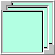

# :card_index: **`uix.CardPanel`**



Show one element (card) from a list

## Syntax

* **`cp = uix.CardPanel()`** creates a new, default, *unparented*, card panel which allows selection between its different child objects. Changing the **`Selection`** property of the card panel makes the corresponding child element fill the space available in the card panel, and makes all the other children invisible. Card panels are commonly used for creating wizards or to allow switching between different views of a single dataset.

* **`cp = uix.CardPanel( n1, v1, n2, v2, ... )`** also sets one or more property values.

## Properties

| Name | Description | Type |
| --- | --- | --- |
| **`BackgroundColor`** | Background color. | [color](https://www.mathworks.com/help/matlab/creating_plots/specify-plot-colors.html) |
| **`Contents`** | Children, in order of addition to the layout, regardless of **`HandleVisibility`**; settable only to a permutation of itself. | graphics vector | 
| **`Padding`** | Space around contents, in pixels. | nonnegative scalar integer
| **`Parent`** | Parent figure or container. | figure, panel, [etc.](https://www.mathworks.com/help/matlab/ref/matlab.ui.container.panel-properties.html#mw_e4809363-1f35-4bc7-89f8-36ed9cccb017) |
| **`Position`** | Position within parent figure or container, in **`Units`**. | `[left, bottom, width, height]`  |
| **`Selection`** | Index of the visible child. | nonnegative scalar integer |
| **`Units`** | Position units; default is `"normalized"`. | `"normalized"`, `"pixels"`, [etc.](https://www.mathworks.com/help/matlab/ref/matlab.ui.container.panel-properties.html#bub8wap-1_sep_shared-Position) |
| **`Visible`** | Visibility; default is `"on"`. | `"on"` or `"off"` |

plus other [container properties](https://www.mathworks.com/help/matlab/ref/matlab.ui.container.panel-properties.html):
* Interactivity: **`ContextMenu`**
* Callbacks: **`SizeChangedFcn`**, **`ButtonDownFcn`**, **`CreateFcn`**, **`DeleteFcn`**
* Callback execution control: **`Interruptible`**, **`BusyAction`**, **`BeingDeleted`**, **`HitTest`**
* Parent/child: **`Children`**, **`HandleVisibility`**
* Identifiers: **`Type`**, **`Tag`**, **`UserData`**

## Examples

### Add multiple buttons to a card panel

```matlab
f = figure();
cp = uix.CardPanel( 'Parent', f, 'Padding', 5 );
uicontrol( 'Parent', cp, 'Style', 'pushbutton', 'BackgroundColor', 'r', ...
'String', 'Button 1', 'ForegroundColor', 'w', 'FontSize', 40 )
uicontrol( 'Parent', cp, 'Style', 'pushbutton', 'BackgroundColor', 'g', ...
'String', 'Button 2', 'ForegroundColor', 'w', 'FontSize', 40 )
uicontrol( 'Parent', cp, 'Style', 'pushbutton', 'BackgroundColor', 'b', ...
'String', 'Button 3', 'ForegroundColor', 'w', 'FontSize', 40 )
cp.Selection = 2;
```

### Add multiple axes to a card panel in web graphics

```matlab
f = uifigure( "AutoResizeChildren", "off" );
cp = uix.CardPanel( "Parent", f );

ax = axes( uicontainer( cp ) );
plot( ax, cumsum( randn( 100, 1 ) ) )
title( ax, "Axes 1" )

ax = axes( uicontainer( cp ) );
plot( ax, cumsum( randn( 100, 1 ) ) )
title( ax, "Axes 2" )
```
Change the selection.
```matlab
cp.Selection = 1;
```

## See also

* :page_facing_up: [**`uix.Panel`**](uixPanel.md): Arrange a single element inside a standard panel
* :black_square_button: [**`uix.BoxPanel`**](uixBoxPanel.md): Arrange a single element in a panel with boxed title and optional toolbar controls
* :point_right: [**`uix.TabPanel`**](uixTabPanel.md): Arrange elements in a panel with tabs for selecting which element is visible
* :scroll: [**`uix.ScrollingPanel`**](uixScrollingPanel.md): Arrange a single element inside a scrollable panel