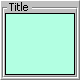

# :page_facing_up: **`uix.Panel`**



Arrange a single element inside a standard panel

## Syntax

* **`p = uix.Panel()`** creates a new, default, *unparented*, standard [**`uipanel`**](https://www.mathworks.com/help/matlab/ref/uipanel.html) object, with automatic management of the contained control or layout. The available properties are largely the same as the standard [**`uipanel`**](https://www.mathworks.com/help/matlab/ref/uipanel.html) object.

* **`p = uix.Panel( n1, v1, n2, v2, ... )`** also sets one or more property values.

## Properties

| Name | Description | Type |
| --- | --- | --- |
| **`BackgroundColor`** | Background color. | [color](https://www.mathworks.com/help/matlab/creating_plots/specify-plot-colors.html) |
| **`BorderType`** | Type of border around the box panel area. | `"none"` \| `"etchedin"` \| `"etchedout"` \| `"beveledin"` \| `"beveledout"` \| `"line"` |
| **`BorderWidth`** | Width of the box panel border. | nonnegative real scalar |
| **`Contents`** | Children, in order of addition to the layout, regardless of **`HandleVisibility`**; settable only to a permutation of itself. | graphics vector |
| **`FontAngle`** | Title font angle. | `"normal"` \| `"italic"` |
| **`FontName`** | Title font name (e.g., `"Arial"`, `"Helvetica"`, etc). | `string` scalar |
| **`FontSize`** | Title font size. | positive scalar integer |
| **`FontUnits`** | Title font units. | `"inches"` \| `"centimeters"` \| `"normalized"` \| `"points"` \| `"pixels"` |
| **`FontWeight`** | Title font weight. | `"normal"` \| `"bold"` |
| **`ForegroundColor`** | Title font color and/or color of 2D border line. | [color](https://www.mathworks.com/help/matlab/creating_plots/specify-plot-colors.html) |
| **`Padding`** | Space around contents, in pixels. | nonnegative scalar integer |
| **`Parent`** | Parent figure or container. | figure, panel, [etc.](https://www.mathworks.com/help/matlab/ref/matlab.ui.container.panel-properties.html#mw_e4809363-1f35-4bc7-89f8-36ed9cccb017) |
| **`Position`** | Position within parent figure or container, in **`Units`**. | `[left, bottom, width, height]` |
| **`Title`** | Title string. | `string` scalar |
| **`TitlePosition`** | Location of title text in relation to the panel. | `"lefttop"` \| `"centertop"` \| `"righttop"` \| `"leftbottom"` \| `"centerbottom"` \| `"rightbottom"` |
| **`Units`** | Position units; default is `"normalized"`. | `"normalized"`, `"pixels"`, [etc.](https://www.mathworks.com/help/matlab/ref/matlab.ui.container.panel-properties.html#bub8wap-1_sep_shared-Position) |
| **`Visible`** | Visibility; default is `"on"`. | `"on"` or `"off"` |

plus other [container properties](https://www.mathworks.com/help/matlab/ref/matlab.ui.container.panel-properties.html):
* Interactivity: **`ContextMenu`**
* Callbacks: **`SizeChangedFcn`**, **`ButtonDownFcn`**, **`CreateFcn`**, **`DeleteFcn`**
* Callback execution control: **`Interruptible`**, **`BusyAction`**, **`BeingDeleted`**, **`HitTest`**
* Parent/child: **`Children`**, **`HandleVisibility`**
* Identifiers: **`Type`**, **`Tag`**, **`UserData`**
* Colors: **`HighlightColor`**, **`ShadowColor`**

### :warning: Deprecated

| Name | Alternative | Type | Notes |
| --- | --- | --- | --- |
| **`Selection`** | none | nonnegative scalar integer | No longer has any effect. In previous versions, the currently visible child was determined using this property. |

## Examples

### Add a button to a panel

```matlab
f = figure();
p = uix.Panel( 'Parent', f, 'Title', 'A Panel', 'Padding', 5 );
uicontrol( 'Parent', p, 'Style', 'pushbutton', 'BackgroundColor', 'r' )
```

### Add a listbox and a button to a [horizontal layout](uixHBox.md) inside a panel

```matlab
f = figure();
p = uix.Panel( 'Parent', f, 'Title', 'A Panel', 'TitlePosition', 'centertop' );
hb = uix.HBox( 'Parent', p, 'Spacing', 5, 'Padding', 5 );
uicontrol( 'Parent', hb, 'Style', 'listbox', 'String', {'Item 1', 'Item 2'} )
uicontrol( 'Parent', hb, 'BackgroundColor', 'b' )
hb.Widths = [100, -1];
```

### Add a table to a panel in web graphics

```matlab
f = uifigure( "AutoResizeChildren", "off" );
p = uix.Panel( "Parent", f, "Title", "A Panel", "Units", "normalized", "Position", [0.05, 0.05, 0.90, 0.90] );
uitable( p, "Data", magic( 5 ) );
```

### Create a simple color-changing app

This example shows how to arrange layouts and controls in
a simple app with a callback. The app contains a listbox with multiple color names, and a panel with background color controlled by the selection in the listbox. The code for this example is available in `callbackExample.m`.

```matlab
edit callbackExample 
```

First, we define the application data, comprising the color names and corresponding RGB values.

```matlab
colorNames = {'Red', 'Orange', 'Yellow', 'Green', ...
    'Blue', 'Indigo', 'Violet'};
colorValues = [1.0, 0.2, 0.2;
    1.0, 0.6, 0.2;
    1.0, 1.0, 0.4;
    0.6, 1.0, 0.6;
    0.2, 0.4, 1.0;
    0.4, 0.1, 0.6;
    0.7, 0.5, 1.0]; 
```

Next, we create the figure window and add a standard panel. Add a [flexible horizontal layout](uixHBox.md) to the standard panel.

```matlab
%% Create a new figure window and remove the toolbar and menus.
f = figure( 'Name', 'Callback Example', ...
    'MenuBar', 'none', ...
    'Toolbar', 'none', ...
    'NumberTitle', 'off' );

%% Add a standard panel.
p = uix.Panel( 'Parent', f, ...
    'Title', 'Color Selection App', ...
    'TitlePosition', 'centertop' );

%% Add a flexible horizontal layout to the panel.
hbf = uix.HBoxFlex( 'Parent', p, ...
    'Spacing', 5, ...
    'Padding', 5 ); 
```

Next, add a listbox on the left and a panel on the right. The listbox **`Callback`** property is the function that will be called automatically when the user interacts with the items in the list.

```matlab
%% Add the listbox and panel.
lb = uicontrol( 'Parent', hbf, ...
    'Style', 'listbox', ...
    'String', colorNames, ...    
    'Callback', @onColorSelected );
c = uipanel( 'Parent', hbf, ...
    'BorderType', 'none', ...
    'Title', ['Selected Color: ', colorNames{1}], ...    
    'FontSize', 12, ...
    'BackgroundColor', colorValues(1, :) );

% Adjust the layout widths.
hbf.Widths = [-1, -3]; 
```

The callback function is defined as follows. Within the callback, the first step is to identify which element of the list the user has just selected. This is given by the **`Value`** property of the listbox, which is the numeric index of the selected item. Given this index, we can update the panel by setting its **`BackgroundColor`** to the corresponding element of the `colorValues` array, and updating its **`Title`** to display the name of the selected color. The name of the selected color is obtained by indexing into the `colorNames` array using the selection index.

```matlab
function onColorSelected( ~, ~ )

    % Obtain the index of the selected color from the listbox.
    selectionIdx = lb.Value;

    % Update the panel.
    newColor = colorValues(selectionIdx, :);
    set( c, 'BackgroundColor', newColor, ...
    'Title', ['Selected Color: ', colorNames{selectionIdx}] )

end % onColorSelected 
```

Run the example.

```matlab
callbackExample
```

## Related Topics
* :card_index: [**`uix.CardPanel`**](uixCardPanel.md): Show one element (card) from a list
* :black_square_button: [**`uix.BoxPanel`**](uixBoxPanel.md): Arrange a single element in a panel with boxed title and optional toolbar controls
* :point_right: [**`uixTabPanel`**](uixTabPanel.md): Arrange elements in a panel with tabs for selecting which element is visible
* :scroll: [**`uix.ScrollingPanel`**](uixScrollingPanel.md): Arrange a single element inside a scrollable panel