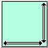

# `uix.ScrollingPanel`



Arrange a single element inside a scrollable panel

## Syntax

* `sp = uix.ScrollingPanel()` creates a new scrolling panel. A scrolling panel arranges a single element inside a panel and provide scrollbars if the panel is smaller than the element.
* `sp = uix.ScrollingPanel( <propertyName>, <propertyValue>, ... )` also sets one or more property values.

## `uix.ScrollingPanel` Properties

## Examples

### Plot a surface in a scrolling panel

```matlab
f = figure( 'Name', 'uix.ScrollingPanel Example' );
f.Position(3:4) = 400;
sp = uix.ScrollingPanel( 'Parent', f );
ax = axes( 'Parent', sp );
[x, y, z] = peaks();
surf( ax, x, y, z )
ax.ActivePositionProperty = 'position';
set( sp, 'Width', 600, 'Height', 600, 'HorizontalOffset', 100, 'VerticalOffset', 100 )
```

### Visualize an image in a scrolling panel in web graphics

```matlab
f = uifigure( "AutoResizeChildren", "off" );
sp = uix.ScrollingPanel( "Parent", f );
ax = axes( "Parent", sp );
im = rand( 1e3, 1e3, 3 );
image( ax, im )
ax.PositionConstraint = "innerposition";
set( sp, "Width", 1000, "Height", 1000, "HorizontalOffset", 100, "VerticalOffset", 100 )
```

## Compatibility
* In version 2.3.9, the `Selection` property no longer has any effect. In previous versions, the currently visible child of the `uix.ScrollingPanel` object was determined using the `Selection` property.
* In version 2.3.9, the following properties were renamed. Existing code is unaffected by these changes.

| Previous Property Name | New Property Name |
| :-- | :-- |
| `Heights` | `Height` |
| `MinimumHeights` | `MinimumHeight` |
| `Widths` | `Width` |
| `MinimumWidths` | `MinimumWidth` |
| `VerticalSteps` | `VerticalStep` |
| `VerticalOffsets` | `VerticalOffset` |
| `HorizontalSteps` | `HorizontalStep` |
| `HorizontalOffsets` | `HorizontalOffset` |

## See also
* [`uix.Panel`](uixPanel.md): Arrange a single element inside a standard panel
* [`uix.CardPanel`](uixCardPanel.md): Show one element (card) from a list
* [`uix.BoxPanel`](uixBoxPanel.md): Arrange a single element in a panel with boxed title and optional toolbar controls
* [`uix.TabPanel`](uixTabPanel.md): Arrange elements in a panel with tabs for selecting which element is visible
