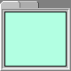

# `uix.TabPanel`



Arrange elements in a panel with tabs for selecting which element is visible

## Syntax

* `tp = uix.TabPanel()` creates a panel with tabs along one edge to allow selection between the different child elements contained in the panel.
* `tp = uix.TabPanel( <propertyName>, <propertyValue>, ... )` also sets one or more property values.

## `uix.TabPanel` Properties

## Examples

### Add three buttons to a tab panel 
```matlab
f = figure();
tp = uix.TabPanel( 'Parent', f, 'Padding', 5 );
uicontrol( 'Parent', tp, 'Style', 'pushbutton', 'BackgroundColor', 'r' )
uicontrol( 'Parent', tp, 'Style', 'pushbutton', 'BackgroundColor', 'b' )
uicontrol( 'Parent', tp, 'Style', 'pushbutton', 'BackgroundColor', 'g' )
tp.TabTitles = {'Red', 'Blue', 'Green'};
tp.Selection = 2;
```

### Add controls to a tab panel in web graphics
```matlab
f = uifigure( "AutoResizeChildren", "off" );
tp = uix.TabPanel( "Parent", f, "TabLocation", "left" );
uibutton( tp, "BackgroundColor", "m" );
uilistbox( tp );
uitable( tp, "Data", magic( 5 ) );
```

Disable the second tab. Select the third.
```matlab
tp.TabEnables{2} = 'off';
tp.Selection = 3;
```

## Compatibility
* In version 2.3.9, stylistic properties of the tab titles (`FontSize`, `FontColor`, ...) no longer have any effect. This is due to a change in the underlying implementation, which now uses `uitabgroup` and `uitab` to create the tab group and tabs.

## See also
* [`uix.Panel`](uixPanel.md): Arrange a single element inside a standard panel
* [`uix.CardPanel`](uixCardPanel.md): Show one element (card) from a list
* [`uix.BoxPanel`](uixBoxPanel.md): Arrange a single element in a panel with boxed title and optional toolbar controls
* [`uix.ScrollingPanel`](uixScrollingPanel.md): Arrange a single element inside a scrollable panel